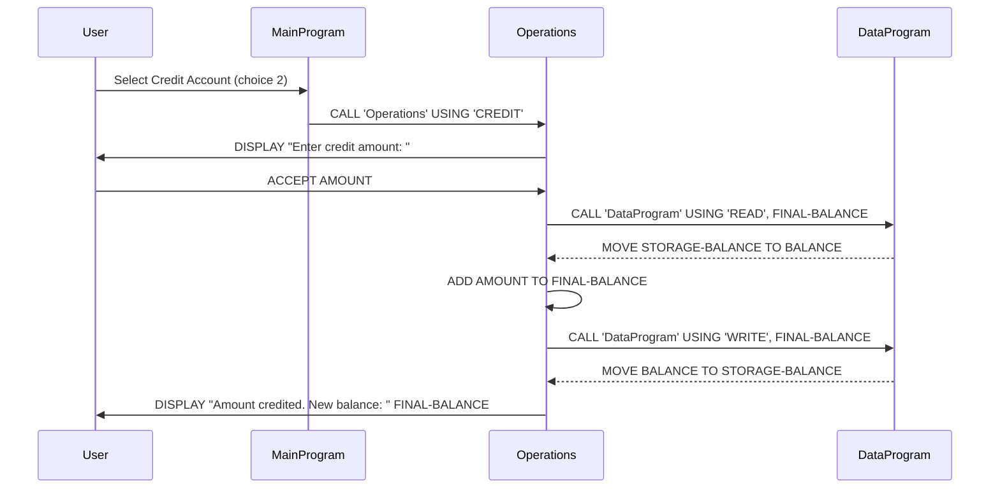

# Lab4_v1.0 - COBOL Account Management System

## Overview

This project implements a simple account management system in COBOL, designed for managing student accounts. It provides basic banking operations such as viewing balance, crediting, and debiting accounts.

## COBOL Files

### data.cob

**Purpose:** Handles data persistence for the account balance.

**Key Functions:**
- Stores the account balance in WORKING-STORAGE.
- Provides read/write operations via linkage section.
- Supports 'READ' operation to retrieve current balance.
- Supports 'WRITE' operation to update balance.

**Business Rules:**
- Initial balance is set to 1000.00.
- Balance is stored as PIC 9(6)V99 (up to 999999.99).

### main.cob

**Purpose:** Main entry point of the application, providing a user interface menu.

**Key Functions:**
- Displays a menu with options: View Balance, Credit Account, Debit Account, Exit.
- Accepts user input and calls appropriate operations.
- Loops until user chooses to exit.

**Business Rules:**
- Menu-driven interface for student account management.
- Validates user choice (1-4), displays error for invalid input.

### operations.cob

**Purpose:** Implements the core business logic for account operations.

**Key Functions:**
- TOTAL: Displays current balance by calling data.cob to read balance.
- CREDIT: Prompts for amount, adds to balance, updates storage.
- DEBIT: Prompts for amount, checks if sufficient funds, subtracts if possible, updates storage.

**Business Rules:**
- Credit operation always succeeds, no upper limit.
- Debit operation checks if balance >= amount before proceeding.
- Displays "Insufficient funds" message if debit amount exceeds balance.
- All operations update the persistent balance via data.cob.

## Business Rules for Student Accounts

- Accounts start with an initial balance of $1000.00.
- Students can view their current balance at any time.
- Credit operations allow adding funds without restrictions.
- Debit operations are restricted by available balance to prevent overdrafts.
- All transactions are processed immediately and balance is updated in real-time.

## Sequence Diagram

The following sequence diagram illustrates the data flow for a credit operation in the account management system.

